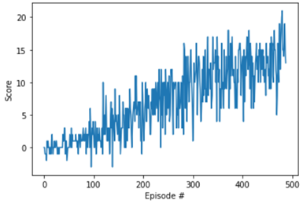

# Report: Project — Navigation

## Learning Algorithm

The agent is trained using **Deep Q-Learning (DQN)**, as introduced in [Mnih et al., 2015](https://www.nature.com/articles/nature14236). A neural network is used to approximate the action-value function `Q(s, a)`, mapping the 37-dimensional state to Q-values for each of the 4 discrete actions. Two techniques from the original DQN paper are used to stabilize training:

- **Experience Replay**: transitions `(state, action, reward, next_state, done)` are stored in a fixed-size replay buffer. During learning, random mini-batches are sampled from this buffer instead of learning from consecutive transitions. This breaks the temporal correlation between consecutive experiences and improves data efficiency by reusing past transitions.

- **Fixed Q-Targets**: two copies of the network are maintained — a local network (`qnetwork_local`), which is updated at every learning step, and a target network (`qnetwork_target`), which is used only to compute the TD target and is updated more slowly. This prevents the "moving target" problem that arises from using the same, constantly-changing network to both select actions and evaluate them, which would otherwise make training unstable.

The target network is updated via a **soft update** rule after every learning step, rather than a hard periodic copy:

```
θ_target = τ * θ_local + (1 - τ) * θ_target
```

### Training procedure

At each timestep, the agent selects an action using an **epsilon-greedy policy**: with probability `eps` it selects a random action (exploration), and otherwise selects the action with the highest predicted Q-value (exploitation). `eps` starts at 1.0 and decays multiplicatively after every episode, down to a floor of 0.01, gradually shifting the agent from exploration toward exploitation as training progresses.

Every 4 timesteps (`UPDATE_EVERY`), if the replay buffer contains more than one batch's worth of experience, a random batch is sampled and used to compute the loss:

```
Q_targets = r + γ * max_a' Q_target(s', a')
loss = MSE(Q_local(s, a), Q_targets)
```

This loss is backpropagated through `qnetwork_local` using the Adam optimizer, followed by a soft update of `qnetwork_target`.

### Network Architecture

`QNetwork` (see `model.py`) is a simple fully-connected feedforward network:

| Layer | Input → Output | Activation |
|---|---|---|
| fc1 | 37 → 64 | ReLU |
| fc2 | 64 → 64 | ReLU |
| fc3 | 64 → 4 | (none — raw Q-values) |

The input size (37) matches the state space, and the output size (4) matches the number of discrete actions.

### Hyperparameters

| Hyperparameter | Value | Description |
|---|---|---|
| `BUFFER_SIZE` | 1e5 | Replay buffer size |
| `BATCH_SIZE` | 64 | Minibatch size sampled for each learning step |
| `GAMMA` | 0.99 | Discount factor |
| `TAU` | 1e-3 | Soft update interpolation factor for the target network |
| `LR` | 5e-4 | Adam optimizer learning rate |
| `UPDATE_EVERY` | 4 | Number of timesteps between learning updates |
| `n_episodes` | 2000 | Maximum training episodes |
| `max_t` | 1000 | Maximum timesteps per episode |
| `eps_start` | 1.0 | Initial epsilon (exploration rate) |
| `eps_end` | 0.01 | Minimum epsilon |
| `eps_decay` | 0.995 | Multiplicative epsilon decay per episode |

## Plot of Rewards



The environment was considered solved once the average score over 100 consecutive episodes reached **+13**. Training progress:

| Episode | Average Score (last 100) |
|---|---|
| 100 | 0.75 |
| 200 | 3.63 |
| 300 | 7.74 |
| 400 | 10.92 |
| 488 | 13.00 |

**The environment was solved in 388 episodes** (i.e., episodes 289–388 averaged a score of +13.00). After training, the saved weights (`checkpoint.pth`) were evaluated over one greedy episode (epsilon = 0, no exploration), achieving a score of **17.0**, confirming the learned policy generalizes beyond the training-time epsilon-greedy behavior.

## Ideas for Future Work

Several extensions could improve learning speed, stability, or final performance:

- **Double DQN** — decouples action selection from action evaluation by using the local network to select the best next action and the target network to evaluate it. This reduces the overestimation bias inherent in standard DQN's `max` operator over noisy Q-value estimates.

- **Dueling DQN** — splits the network into two streams that separately estimate the state-value `V(s)` and the action-advantage `A(s, a)`, recombining them into Q-values. This can improve learning efficiency, particularly in states where the choice of action doesn't strongly affect the outcome.

- **Prioritized Experience Replay** — instead of sampling transitions uniformly from the replay buffer, transitions with higher TD-error (i.e., ones the agent is currently predicting poorly) are sampled more frequently. This tends to speed up convergence by focusing learning on the most informative experiences.

- **Rainbow-style combination** — combining Double DQN, Dueling DQN, and Prioritized Experience Replay together (along with other Rainbow components such as multi-step bootstrapping or noisy networks) to compound their individual benefits.

- **Hyperparameter tuning** — a systematic sweep over learning rate, network width/depth, `UPDATE_EVERY`, and epsilon decay schedule could likely reduce the number of episodes needed to solve the environment below the 388 achieved here.

- **Learning from pixels** — training directly from the raw 84×84 RGB visual observations (the "Challenge: Learning from Pixels" variant of this environment) rather than the pre-processed 37-dimensional ray-perception state, using a convolutional network as the function approximator.
